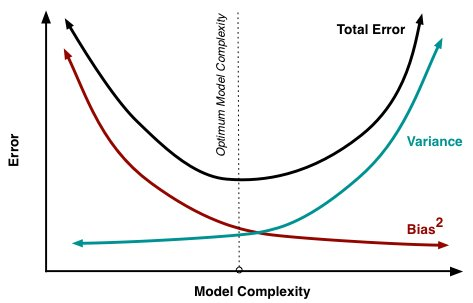
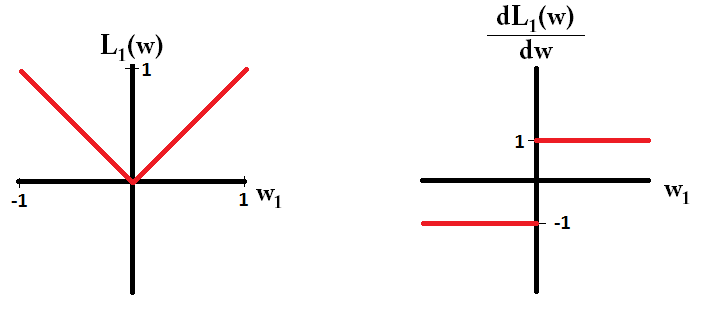
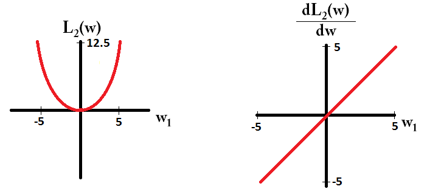

# Bias Variance Trade-Off

Predictive models have a tradeoff between **bias** (how well the model fits the data) and **variance** (how much the model changes based on changes in the inputs).

_Simpler models_ are stable (low variance) but they don't get close to the truth (high bias).

More _complex models_ are more prone to being overfit (high variance) but they are expressive enough to get close to the truth (low bias).

The best model for a given problem usually lies somewhere in the middle.

# How to Prevent Overfitting

Detecting overfitting is useful, but it doesn't solve the problem. Fortunately, you have several options to try.

Here are a few of the most popular solutions for overfitting:

## Cross-validation

Cross-validation is a powerful preventative measure against overfitting.

The idea is clever: Use your initial training data to generate multiple mini train-test splits. Use these splits to tune your model.

In standard k-fold cross-validation, we partition the data into k subsets, called folds. Then, we iteratively train the algorithm on k-1 folds while using the remaining fold as the test set (called the "holdout fold").

K-Fold Cross-Validation

Cross-validation allows you to tune hyperparameters with only your original training set. This allows you to keep your test set as a truly unseen dataset for selecting your final model.

We have another article with a [more detailed breakdown of cross-validation](https://elitedatascience.com/machine-learning-iteration#micro).

## Train with more data

It won't work every time, but training with more data can help algorithms detect the signal better. In the earlier example of modeling height vs. age in children, it's clear how sampling more schools will help your model.

Of course, that's not always the case. If we just add more noisy data, this technique won't help. That's why you should always ensure your data is clean and relevant.

## Remove features

Some algorithms have built-in feature selection.

For those that don't, you can manually improve their generalizability by removing irrelevant input features.

An interesting way to do so is to tell a story about how each feature fits into the model. This is like the data scientist's spin on software engineer's [rubber duck debugging](https://en.wikipedia.org/wiki/Rubber_duck_debugging) technique, where they debug their code by explaining it, line-by-line, to a rubber duck.

If anything doesn't make sense, or if it's hard to justify certain features, this is a good way to identify them.

In addition, there are several [feature selection heuristics](https://elitedatascience.com/dimensionality-reduction-algorithms#feature-selection) you can use for a good starting point.

## Early stopping

When you're [training a learning algorithm iteratively](https://elitedatascience.com/machine-learning-iteration#model), you can measure how well each iteration of the model performs.

Up until a certain number of iterations, new iterations improve the model. After that point, however, the model's ability to generalize can weaken as it begins to overfit the training data.

Early stopping refers stopping the training process before the learner passes that point.

Today, this technique is mostly used in deep learning while other techniques (e.g. regularization) are preferred for classical machine learning.

## Regularization

Regularization refers to a broad range of techniques for artificially forcing your model to be simpler.

Shrinkage can be thought of as "a penalty of complexity." Why? If we set some parameters of the model to exactly zero, then the model is effectively shrunk to have lower-dimensionality and less complex. Analogously, if we use a shrinkage mechanism to **zero out some of the parameters** or **smooth the parameters** (the difference of parameters will not be very large), then we are decreasing complexity by reducing dimensions or making it more continuous.

### L1 Regularization or Lasso or L1 norm

$$
L(x,y) = \sum_{i=1}^n(y_i - h_{\theta}(x_i))^2 + \lambda \sum_{i=1}^n |\theta_i|
$$

In L1 regularization we penalize the absolute value of the weights.

### L2 Regularization or Ridge Regularization

$$
L(x,y) = \sum_{i=1}^n(y_i - h_{\theta}(x_i))^2 + \lambda \sum_{i=1}^n \theta_i^2
$$

In L2 regularization, regularization term is the sum of square of all feature weights as shown above in the equation.

### Comparison Between L1 And L2 Regulariztion

- **Computational Efficiency**: (L2 > L1) L2 have analytical solution while L1 is computational inefficient on non-sparse cases

- **Sparsity**: (L1 > L2) refers to that only very few entries in a matrix (or vector) is non-zero. L1-norm has the property of producing many coefficients with zero values or very small values with few large coefficients.

- **Built-in feature selection for L1**: L1-norm tends to produces sparse coefficients, so that L1 can penalize the coefficients toward 0.

  

  

From the figure, we can find out that for L1, the gradient is either 1 or -1, except for when $$w_{1}=0$$, however, for the same $$\lambda$$, it is possible that the weight for L2 norm will never reach zero for the gradient of the weight is also very small, which may result in a smaller penalty for the weight.

### DropOut (Regularization technique)

To apply DropOut, we randomly select a subset of the units and clamp their output to zero, regardless of the input; this effectively removes those units from the model. A different subset of units is randomly selected every time we present a training example.

Below are two possible network configurations. On the first presentation (left), the 1st and 3rd units are disabled, but the 2nd and 3rd units have been randomly selected on a subsequent presentation. At test time, we use the complete network but rescale the weights to compensate for the fact that all of them can now become active (e.g., if you drop half of the nodes, the weights should also be halved).

### DropConnect

DropConnect works similarly, except that we disable individual weights (i.e., set them to zero), instead of nodes, so a node can remain partially active. Schematically, it looks like this:

### Comparison

These methods both work because they effectively let you train several models at the same time, then average across them for testing. For example, the yellow layer has four nodes, and thus 16 possible DropOut states (all enabled, #1 disabled, #1 and #2 disabled, etc).

DropConnect is a generalization of DropOut because it produces even more possible models, since there are almost always more connections than units. However, you can get similar outcomes on an individual trial. For example, the DropConnect network on the right has effectively dropped Unit #2 since all of the incoming connections have been removed.

## [Batch Norm](../General.html#batch-normalization)

## Ensembling

Ensembles are machine learning methods for combining predictions from multiple separate models. There are a few different methods for ensembling, but the two most common are:

_Bagging_ attempts to reduce the chance overfitting complex models.

- It trains a large number of "strong" learners in parallel.
- A strong learner is a model that's relatively unconstrained.
- Bagging then combines all the strong learners together in order to "smooth out" their predictions.

_Boosting_ attempts to improve the predictive flexibility of simple models.

- It trains a large number of "weak" learners in sequence.
- A weak learner is a constrained model (i.e. you could limit the max depth of each decision tree).
- Each one in the sequence focuses on learning from the mistakes of the one before it.
- Boosting then combines all the weak learners into a single strong learner.

While bagging and boosting are both ensemble methods, they approach the problem from opposite directions.

Bagging uses complex base models and tries to "smooth out" their predictions, while boosting uses simple base models and tries to "boost" their aggregate complexity.
