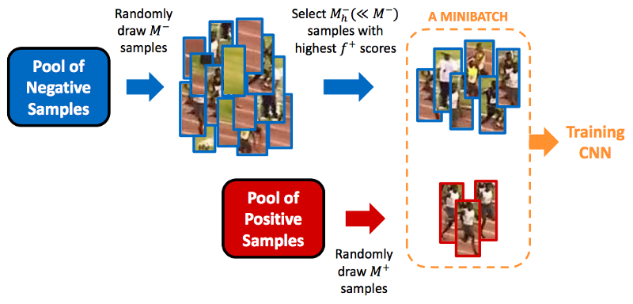

<!-- markdown-toc start - Don't edit this section. Run M-x markdown-toc-refresh-toc -->

**Table of Contents**

- [Single Shot MultiBox Detector(SSD)](#single-shot-multibox-detectorssd)
  - [Architecture](#architecture)
  - [Loss Function](#loss-function)
  - [Hard Negative Mining](#hard-negative-mining)
  - [Data Augmentation](#data-augmentation)

<!-- markdown-toc end -->

# Single Shot MultiBox Detector(SSD)

- **Single Shot**: this means that the tasks of object localization and classification are done in a single forward pass of the network
- **MultiBox**: this is the name of a technique for bounding box regression developed by Szegedy et al. (we will briefly cover it shortly)
- **Detector**: The network is an object detector that also classifies those detected objects

## Architecture

## Loss Function

MultiBox's loss function also combined two critical components that made their way into SSD:

- **Confidence Loss**: this measures how confident the network is of the objectness of the computed bounding box. Categorical cross-entropy is used to compute this loss.
- **Location Loss**: this measures how far away the network's predicted bounding boxes are from the ground truth ones from the training set. L1-Norm is used here.

$$multibox_loss = confidence_loss + alpha * location_loss$$

Where the alpha term helps us in balancing the contribution of the location loss.

## Hard Negative Mining

During training, as most of the bounding boxes will have low IoU and therefore be interpreted as negative training examples, we may end up with a disproportionate amount of negative examples in our training set. Therefore, instead of using all negative predictions, it is advised to **keep a ratio of negative to positive examples of around 3:1**. The reason why you need to keep negative samples is because the network also needs to learn and be explicitly told what constitutes an incorrect detection.

## Data Augmentation

- Generated additional training examples with patches of the original image at different IoU ratios (e.g. 0.1, 0.3, 0.5, etc.) and random patches as well.

- Each image is also randomly horizontally flipped with a probability of 0.5.
