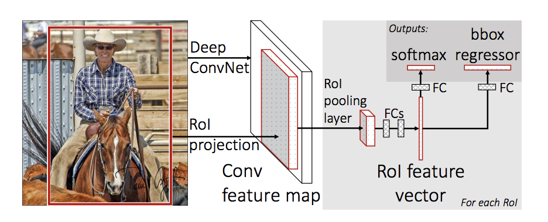

## Fast R-CNN

### [ROI Pooling](ROI.md)

### Network Architecture



- Instead of feeding the region proposals to the CNN, the author feeded the input image to the CNN to generate a convolutional feature map.
- From the convolutional feature map, the author identified the region of proposals and warp them into squares and by using a RoI pooling layer the author reshaped them into a fixed size so that it can be fed into a fully connected layer.
- From the RoI feature vector, the author used a softmax layer to predict the class of the proposed region and also the offset values for the bounding box.

### Implenmentation

```python
class SlowROIPool(nn.Module):
    def __init__(self, output_size):
        super().__init__()
        self.maxpool = nn.AdaptiveMaxPool2d(output_size)
        self.size = output_size

    def forward(self, images, rois, roi_idx):
        n = rois.shape[0]
        h = images.size(2)
        w = images.size(3)
        x1 = rois[:,0]
        y1 = rois[:,1]
        x2 = rois[:,2]
        y2 = rois[:,3]

        x1 = np.floor(x1 * w).astype(int)
        x2 = np.ceil(x2 * w).astype(int)
        y1 = np.floor(y1 * h).astype(int)
        y2 = np.ceil(y2 * h).astype(int)

        res = []
        for i in range(n):
            img = images[roi_idx[i]].unsqueeze(0)
            img = img[:, :, y1[i]:y2[i], x1[i]:x2[i]]
            img = self.maxpool(img)
            res.append(img)
        res = torch.cat(res, dim=0)
        return res

class RCNN(nn.Module):
    def __init__(self):
        super().__init__()

        rawnet = torchvision.models.vgg16_bn(pretrained=True)
        self.seq = nn.Sequential(*list(rawnet.features.children())[:-1])
        # self.roipool = nn.MaxPool2d(kernel_size=(2, 2), stride=(2, 2), dilation=(1, 1))
        self.roipool = SlowROIPool(output_size=(7, 7))
        self.feature = nn.Sequential(*list(rawnet.classifier.children())[:-1])

        _x = Variable(torch.Tensor(1, 3, 224, 224))
        _r = np.array([[0., 0., 1., 1.]])
        _ri = np.array([0])
        _x = self.feature(self.roipool(self.seq(_x), _r, _ri).view(1, -1))
        feature_dim = _x.size(1)
        self.cls_score = nn.Linear(feature_dim, N_CLASS+1)
        self.bbox = nn.Linear(feature_dim, 4*(N_CLASS+1))

        self.cel = nn.CrossEntropyLoss()
        self.sl1 = nn.SmoothL1Loss()

    def forward(self, inp, rois, ridx):
        res = inp
        res = self.seq(res)
        res = self.roipool(res, rois, ridx)
        res = res.detach()
        res = res.view(res.size(0), -1)
        feat = self.feature(res)

        cls_score = self.cls_score(feat)
        bbox = self.bbox(feat).view(-1, N_CLASS+1, 4)
        return cls_score, bbox

    def calc_loss(self, probs, bbox, labels, gt_bbox):
        loss_sc = self.cel(probs, labels)
        lbl = labels.view(-1, 1, 1).expand(labels.size(0), 1, 4)
        mask = (labels != 0).float().view(-1, 1).expand(labels.size(0), 4)
        loss_loc = self.sl1(bbox.gather(1, lbl).squeeze(1) * mask, gt_bbox * mask)
        lmb = 1.0
        loss = loss_sc + lmb * loss_loc
        return loss, loss_sc, loss_loc
```

### Why faster than R-CNN?

The reason “Fast R-CNN” is faster than R-CNN is because you don’t have to **feed 2000 region proposals to the convolutional neural network** every time. Instead, the convolution operation is done only once per image and a feature map is generated from it.
