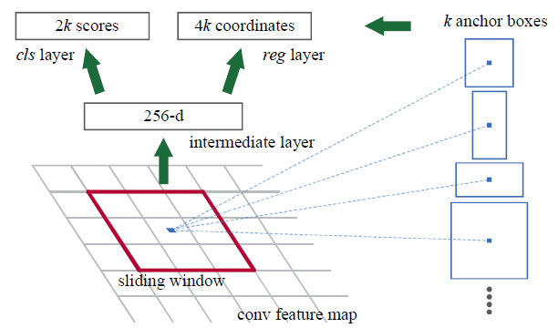
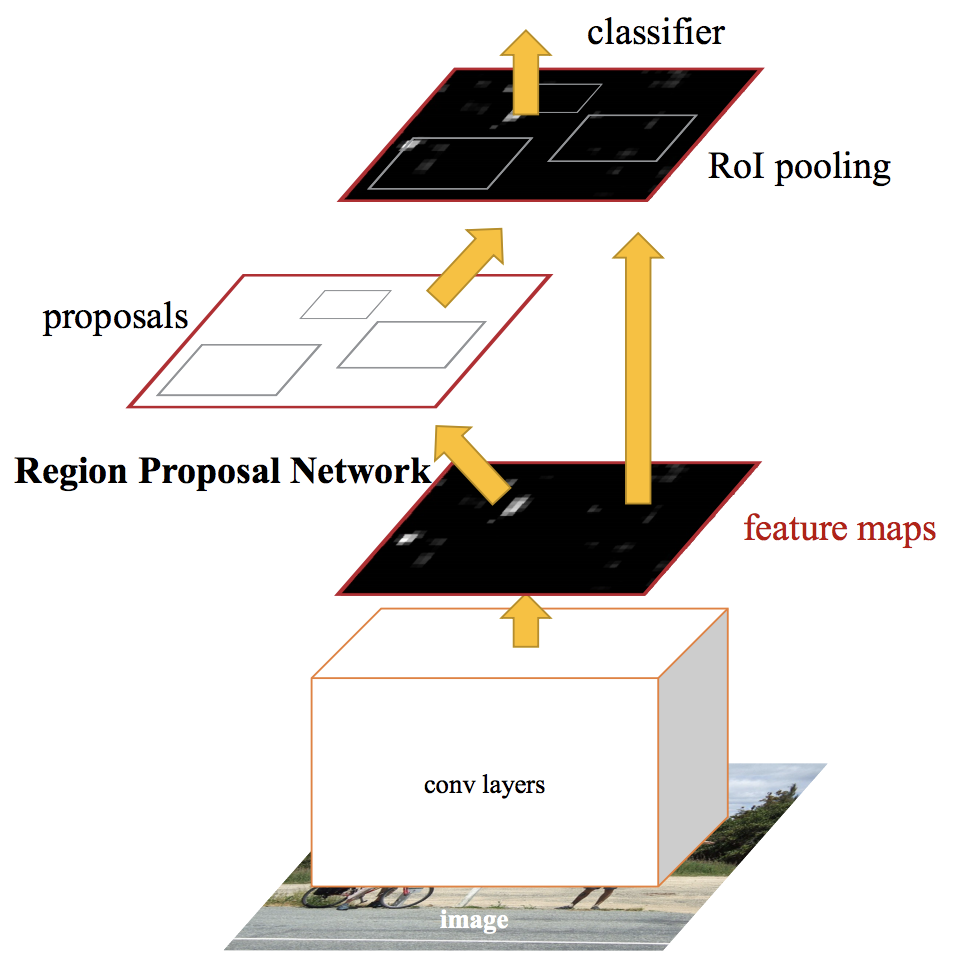

## Faster R-CNN

### Region Proposal Network

1. First, the picture goes through conv layers and feature maps are extracted.
2. Then a **sliding window** is used in RPN for each location over the feature map.
3. For each location, **k (k=9) anchor** boxes are used (**3 scales of 128, 256 and 512, and 3 aspect ratios of 1:1, 1:2, 2:1**) for generating region proposals.
4. A **cls** layer outputs $$2k$$ scores **whether there is object or not** for $$k$$ boxes.
5. A **reg** layer outputs $$4k$$ for the **coordinates** (box center coordinates, width and height) of _k_ boxes.
6. With a size of $$W \times H$$ feature map, there are $$WHk$$ anchors in total.

### Network Architecture

- Similar to Fast R-CNN, the image is provided as an input to a convolutional network which provides a convolutional feature map.
- Instead of using selective search algorithm on the feature map to identify the region proposals, a separate network is used to predict the region proposals(Region Proposal Network).

- The predicted region proposals are then reshaped using a RoI pooling layer which is then used to classify the image within the proposed region and predict the offset values for the bounding boxes.
